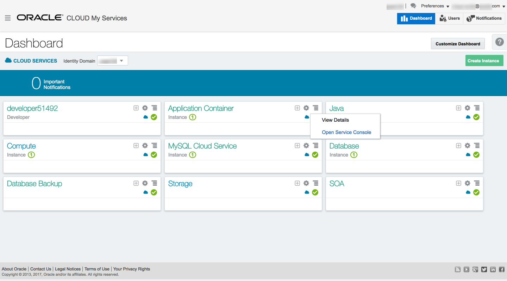
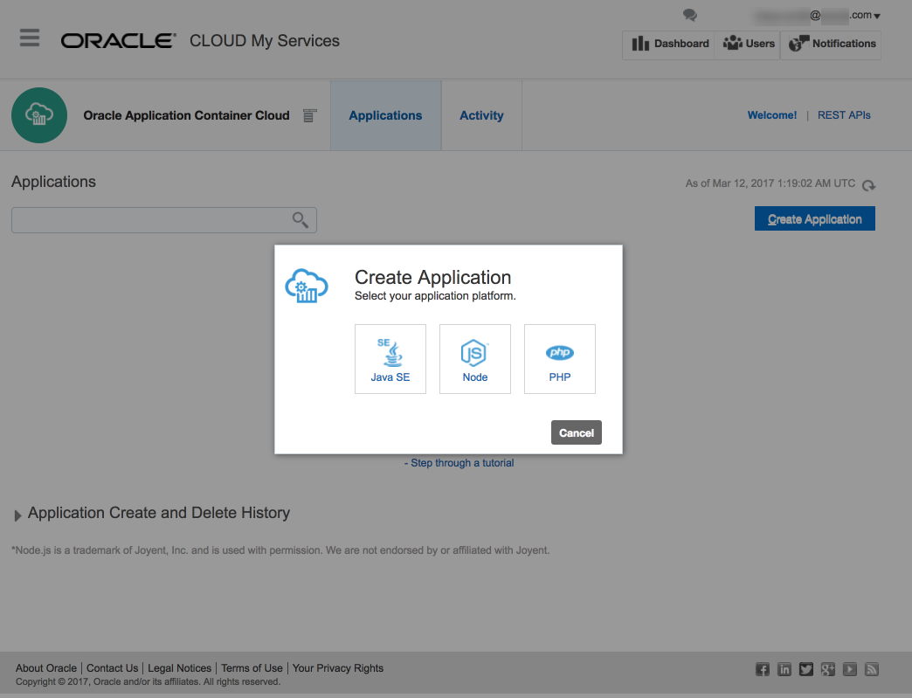

---
# ORACLE Cloud-Native DevOps workshop #

Introduction
============

This sample uses the light weight SparkJava framework to implement a simple
hello world REST service that can return a message defined in an environment
variable.  The goal of this sample is to show how to deploy a simple
Java application to the Oracle Application Container Cloud (ACCS).  The code is
very simple to keep the focus on deployment and not on the Java application
itself.

See [Hello.java](src/main/java/example/Hello.java).

About the Sample
----------------

The Java application itself uses the [Spark Java](http://sparkjava.com/) framework
to implement a simple 'helloworld' REST service.  Here's the entire application
(minus package and import declarations):

    public class Hello {

    	public static final Optional<String> PORT = Optional.ofNullable(System.getenv("PORT"));
    	public static final Optional<String> GREETING = Optional.ofNullable(System.getenv("GREETING"));

    	public static void main(String[] args) {
    		Integer port = Integer.valueOf(PORT.orElse("8080"));
    		port(port);

    		get("/", (req, res) -> {
    			return GREETING.orElse("Hello World!");
    		});
    	}
    }

The application reads a couple of optional environment variables and then listens
creates a REST service that returns a message when a GET is performed on the root
context "/"--that's it.  

Below we'll show how to build and run the code locally and then how to package
and deploy it to ACCS.

Building
--------

To build this example you'll need to have [Apache Maven 3](http://maven.apache.org)
installed and on your PATH.

Run `mvn clean package` to compile the code and generate a fat jar that includes
all the libraries the application depends on (Spark Java for example). Once the
Maven build has run successfully you'll find a number of artifacts in the `target`
folder including the jar `javaspark-hello-0.0.1-SNAPSHOT-jar-with-dependencies.jar`.

Running Locally
---------------

To run the application on your local desktop:

1. run `java -jar target/javaspark-hello-0.0.1-SNAPSHOT-jar-with-dependencies.jar`
2. Open [http://localhost:8080](http://localhost:8080) in your browser or use a
REST client to GET "/" from the application to obtain the default greeting.
3. Define the environment variable GREETING to a message of your choice in your
environment (e.g., export GREETING="Good Day") and restart the application.  It
 will now return the value of GREETING when you GET "/" as it reads the value
of then environment variable GREETING, if present.

Packaging the Code for Deployment to ACCS
-----------------------------------------

To deploy an application to ACCS you need to provide two things:

1. Your application code, which in this case is just the single fat jar (but
  could be a collection of jars, class files, etc.).
2. A manifest.json file that defines (at least) the version of Java that your
application needs (e.g., 7 or 8) and the command to start your application.

Using the ACCS web browser based service console to deploy your application
you'll need to zip up these two artifacts into a zip file known as an
'application archive'.  The structure of
the archive requires that the manifest.json be in the root so it can be found
by ACCS but otherwise the structure is up to you.  Here's the structure of the
archive we'll deploy (with both artifacts in the root):

    /
      manifest.json
      javaspark-hello-0.0.1-SNAPSHOT-jar-with-dependencies.jar

Here's the manifest.json file for this example:

    {
      "runtime": {
          "majorVersion": "8"
      },
      "command": "java -jar javaspark-hello-0.0.1-SNAPSHOT-jar-with-dependencies.jar",
    }

If you look in the `target` folder you'll find it already contains a zip file
 named `javaspark-hello-0.0.1-SNAPSHOT-dist.zip`.  For convenience, the Maven
 build includes a packaging step after compilation that builds the application
 archive we need to deploy to ACCS.

Deploying the Application to ACCS
---------------------------------

1. Log into your Oracle Public Cloud account first by choosing your datacenter.
[https://cloud.oracle.com/sign-in](https://cloud.oracle.com/sign-in)

2. Provide your identity domain.

3. Provide your user id and password.

4. On the Dashboard open the Application Container Cloud service console.

5. Create an ACCS application.

6. Choose Java as your runtime.

7. Provide a name, select `upload application archive`, select a the file from
the target folder named `javaspark-hello-0.0.1-SNAPSHOT-dist.zip` and press
Create.

8. Your application will be deployed and, when provisioning is complete, you
 can use the application URL to open the application in your browser.
